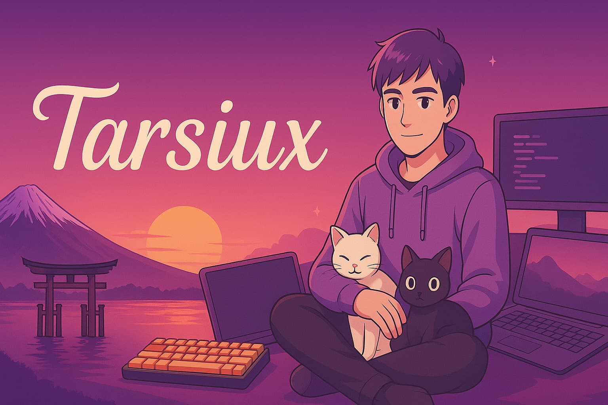

<!-- Banner -->


<!--  Hi -->
<ul align="center"> 
    
    <h1 style="display: inline-block">Hola, soy Tarsiux</h1> 
    
</ul>

<!-- Summary -->
<p>
    Bienvenido a mi perfil de <b>Github</b>. Soy <b>Tecnico en Desarrollo de Aplicaciones Multiplataforma</b>. Si quieres
    conocer mejor mi trabajo te dejo mi <a href="">porfolio</a> y mi <a href="">Linkedin</a>. Sigue scroleando 👇 para un 
    breve resumen de lo que hago y en qué tecnologías me especializo.
</p>


<!-- Abaut me -->
<h2>Sobre mi</h2>

- 💻 Soy Tecnico en <b>Desarrollo de Aplicaciones Multiplataforma</b>.
- 🌱 Actualmente estoy aprendiendo:
    - Algoritmos y estructura de datos
- 🔭 Abierto a cualquier oportunidad laboral. Mi CV esta en el <a href="">porfolio</a>.
- 🙃 <b>Enserio mira mi <a href="">porfolio</a> 🙃.</b>
- 📫 Contacta conmigo en:
```
    sertrujezprofesional+contacto@gmail.com
```

<!-- Skills -->
<h2>Habilidades</h2>

<!-- Repo icon ->  https://github.com/Ileriayo/markdown-badges/blob/master/README.md -->

<h3>Lenguajes</h3>
<span>
    
    
</span>

<h3>Web</h3>
<span>
    
    
</span>

<h3>FrameWorks</h3>
<span>
    
</span>


<h3>Base de Datos</h3>
<span>
    
    
    
</span>

<h3>Control de Versiones</h3>
<span>
    
    
</span>

<!-- More -->
<h2>Mas de mi</h2>